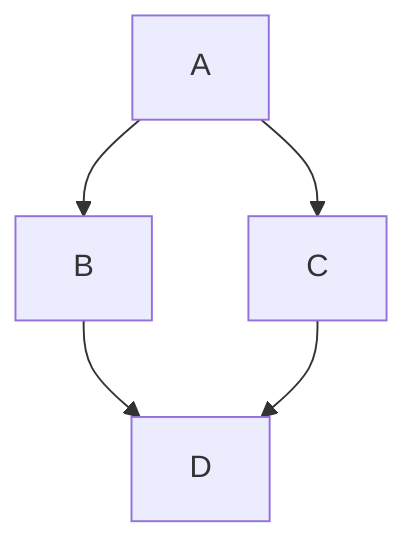

- [Recap](#recap)
- [Code samples](#code-samples)
- [The scenario](#the-scenario)
- [Getting set up](#getting-set-up)
- [The `DbContext`](#the-dbcontext)

## Recap

In the [last post](../../part-1/what-is-entity-framework-core), we covered what Entity Framework Core is, the difference between it and EF6, and some of the databases EF Core has providers available for. In this post, we'll start configuring our code-first database schema through models.

## Code samples

All code samples are available in this [GitHub repo](https://github.com/joshuahills/ef-core-for-junior-devs). You can view them in full context or clone that repo and run them yourself.

To follow along or run the samples, you'll need the following:

- .NET 8 SDK
- the developer edition of Microsoft SQL Server
- SQL Server Management Studio (SSMS)
- An editor/IDE like Visual Studio 2022/Rider/VS Code

> I chose to focus on SQL Server in these posts as the SQL Server EF Core provider is the most downloaded according to NuGet. It's also the one I have the most experience in. Some of these posts will be relevant to other providers, but I will focus on SQL Server and SSMS.

## The scenario

Imagine we're building an social network used by many users. Lets call it "Chirper" (imaginative, I know).

Every second, users post hundreds of "Chirps" (posts). We need to store the Chirps in our database and serve them in a performant manner through a web API.

## Getting set up

After you've installed everything [above](#code-samples), we can create the project. Navigate to a directory you want to store the code in, and then run the following in that directory to get a solution and project set up:

```cmd
 dotnet new webapi -o Chirper
```

This will create a new ASP.NET Core Web API project. Open the generated `Program.cs` file in your IDE. You'll see some example code automatically inserted in here - you can remove that. Your `Program.cs` file should look like this:

```c#
// Program.cs
var builder = WebApplication.CreateBuilder(args);

// Add services to the container.
// Learn more about configuring Swagger/OpenAPI at https://aka.ms/aspnetcore/swashbuckle
builder.Services.AddEndpointsApiExplorer();
builder.Services.AddSwaggerGen();

var app = builder.Build();

// Configure the HTTP request pipeline.
if (app.Environment.IsDevelopment())
{
    app.UseSwagger();
    app.UseSwaggerUI();
}

app.UseHttpsRedirection();
```

Lets install EF Core and then we're all ready to go. By installing the SQL Server provider, the other required EF Core packages will be installed. In a terminal:

```cmd
dotnet add package Microsoft.EntityFrameworkCore.SqlServer --version 8.0.0
```

If you open `Chirper.csproj`, you should now see a `<PackageReference>` block for this package.

## The `DbContext`

We're now going to create a class that can be thought of an abstraction of the database. It's where you define the tables and EF Core's behaviour for the entities.

Lets create a folder in our project called "Context". Add a class to that folder called "ChirperDbContext". Make it extend `DbContext`` from the "Microsoft.EntityFrameworkCore" namespace:

```c#
// Context.cs
namespace Chirper.Context;

using Microsoft.EntityFrameworkCore;

public class ChirperDbContext : DbContext
{
}
```

We can now define our entities. To start with, we'll have two: `User` and `Chirp`. A user can send many chirps, but a chirp can only be sent by one user:


